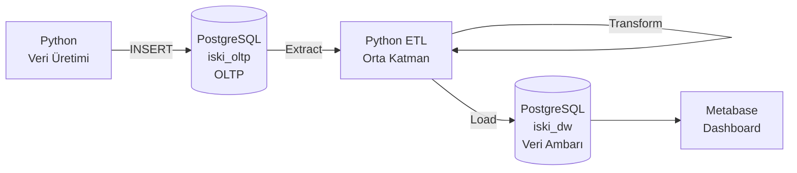

# İSKİ Benzeri Akıllı Su Yönetim Sistemi

İSKİ Veri Yönetimi ve Sistemleri Şefliği stajı sırasında gözlemlenen **veritabanı → orta katman (ETL) → veri ambarı** mimarisinden esinlenerek geliştirilmiş, uçtan uca bir su yönetim veri sistemi prototipidir.

Sistem; sahte ama gerçekçi abone, sayaç okuma ve arıza verisi üretir, bunları işlemsel bir veritabanında tutar, ETL süreciyle analiz odaklı bir veri ambarına aktarır ve son olarak bir BI aracıyla görselleştirir.

## Mimari



Bu üç katman, İSKİ'deki **Veritabanı, Orta Katman ve Veri Ambarı** birimlerinin küçük ölçekli bir yansımasıdır.

| Katman | Rol | Teknoloji |
|---|---|---|
| Veritabanı (OLTP) | Ham, işlemsel veri | PostgreSQL |
| Orta Katman | Veri çekme, temizleme, dönüştürme | Python (pandas, SQLAlchemy) |
| Veri Ambarı (OLAP) | Analiz odaklı, star schema | PostgreSQL |
| Görselleştirme | Dashboard, raporlama | Metabase |

## Veri Modeli

### OLTP Şeması (iski_oltp)
- `mahalle` — mahalle/ilçe bilgisi
- `abone` — abone bilgisi (mahalleye bağlı)
- `sayac` — su sayaçları (aboneye bağlı)
- `sayac_okuma` — periyodik tüketim okumaları
- `ariza` — arıza/kesinti kayıtları (mahalleye bağlı)

### Veri Ambarı Şeması (iski_dw) — Star Schema
**Dimension tablolar:**
- `dim_zaman` — yıl, ay, çeyrek, mevsim
- `dim_mahalle` — mahalle, ilçe
- `dim_abone` — abone, tarife tipi, abonelik yılı

**Fact tablolar:**
- `fact_su_tuketimi` — tüketim miktarı (tarih, abone, mahalle ile ilişkili)
- `fact_ariza` — arıza süresi ve tipi (tarih, mahalle ile ilişkili)

##  Dashboard

Metabase üzerinde aşağıdaki analizler oluşturuldu:

1. **Mahalle Bazlı Toplam Tüketim** — hangi mahallede su tüketimi en yüksek
2. **Aylık Tüketim Trendi** — zaman içinde tüketim değişimi, mevsimsellik
3. **İlçe Bazlı Arıza Sıklığı** — hangi ilçede arıza yoğunluğu fazla
4. **Tarife Tipine Göre Ortalama Tüketim** — konut/ticari/resmi karşılaştırması
5. **Mevsime Göre Ortalama Tüketim** — yaz/kış tüketim farkı

##  Kurulum

### Gereksinimler
- Docker Desktop
- Python 3.10+
- pgAdmin (opsiyonel, veritabanı yönetimi için)

### 1. PostgreSQL container'ını başlatma
```bash
docker run --name iski-postgres \
  -e POSTGRES_USER=iski \
  -e POSTGRES_PASSWORD=iski123 \
  -e POSTGRES_DB=iski_oltp \
  -p 5432:5432 \
  -d postgres:16
```

### 2. Veritabanı şemasını oluşturma
`sql/01_oltp_schema.sql` dosyasındaki komutları `iski_oltp` veritabanında çalıştır.

`iski_dw` adında ikinci bir veritabanı oluştur, `sql/02_dw_schema.sql` dosyasındaki komutları orada çalıştır.

### 3. Python bağımlılıklarını kurma
```bash
pip install pandas psycopg2-binary sqlalchemy faker
```

### 4. Örnek veri üretme
```bash
python3 scripts/veri_uret.py
```

### 5. ETL süreci
```bash
python3 scripts/etl.py
```

### 6. Metabase'i başlatma
```bash
docker run -d -p 3000:3000 --name iski-metabase metabase/metabase
```
Tarayıcıdan `http://localhost:3000` adresine git, `iski_dw` veritabanına bağlan (host: `host.docker.internal`), dashboard'u oluştur.

## 🔍 Kullanılan Analiz Sorguları

Tüm SQL analiz sorguları `sql/03_analiz_sorgulari.sql` dosyasında yer almaktadır.


##  Not

Bu proje, İSKİ Veri Yönetimi ve Sistemleri Şefliği stajı sırasında edinilen gözlemlerden ilham alınarak, tamamen sahte/simüle veriyle, öğrenme amacıyla geliştirilmiştir. Gerçek İSKİ verisi veya sistemleriyle hiçbir bağlantısı yoktur.

## Kullanılan Teknolojiler

- PostgreSQL 16
- Python (pandas, SQLAlchemy, Faker)
- Docker
- Metabase
- pgAdmin
